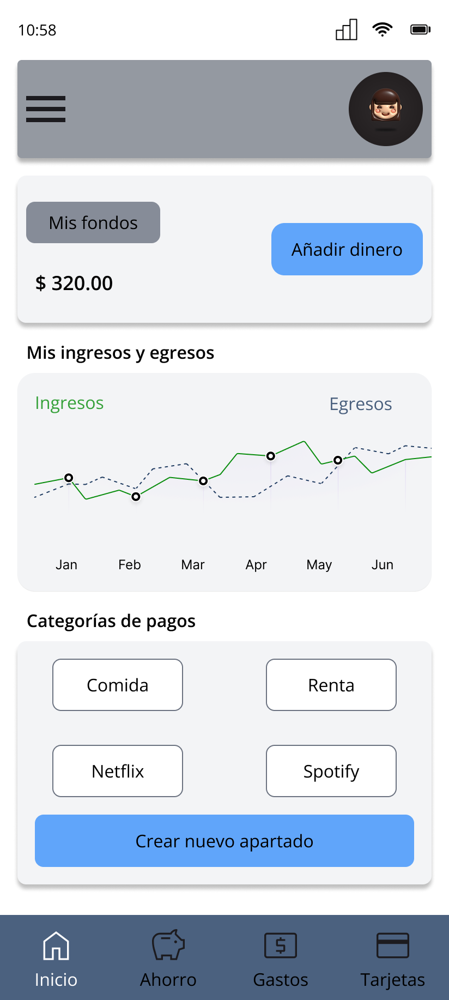

## 🌱 Sobre mí 

Soy diseñadora UX/UI que llegó al diseño desde la pedagogía.
El entorno educativo digital me permitió entender que la empatía con los usuarios es el punto central para diseñar productos digitales fáciles de navegar.  

---

## 🛠️ Herramientas y habilidades

**Diseño UX/UI**

**Investigación de usuarios y testing**

**Metodologías**

**Desarrollo y accesibilidad**

**Colaboración y entrega**

**IA aplicada al diseño**

**Idiomas**

---

## 📁 Proyectos

### Morralla — Organizar finanzas personales de forma accesible, intuitiva y sin tecnicismos 💰

**1. Desafío**

Crear una aplicación móvil que ayude a los usuarios a entender en qué gastan su dinero, permitiéndoles:
- Organizar sus ingresos y egresos.
- Detectar hábitos financieros.
- Mejorar sus decisiones sin sentirse abrumadas.

**2. Proceso**

- Realicé entrevistas con usuarios para identificar frustraciones y motivaciones
- Investigé las consideraciones del mercado actual
- Identifiqué insights valiosos con base en necesidades específicas de los usuarios
- Definí 2 user personas y diseñé la arquitectura de la información
- Construí wireframes en baja, media y alta fidelidad, permitiéndome iterar hacia un prototipo navegable
- Conduje pruebas de usabilidad con 5 usuarios sobre el flujo de metas de ahorro

**Herramientas:** Figma · FigJam · Google Forms · Claude  
**Metodología:** Design Thinking

**3. Resultado**

- Los 5 usuarios completaron el flujo de creación de metas de ahorro sin fricción
- 4 de 5 usuarios no lograron retroceder en el proceso 

**4. Visuales**

| Arquitectura de la información | User Flow |
|-------------------------------|-----------|
|  |  |

**Wireframes**

| Baja fidelidad | Media fidelidad | Alta fidelidad |
|---------------|----------------|----------------|
|  |  |  |

**Pantallas finales**

| Home | Metas de ahorro |
|------|----------------|
|  |  |

📊 [Ver caso de estudio completo](https://www.figma.com/deck/nEKuBgUSEuYwIUx5YUtyCu)
